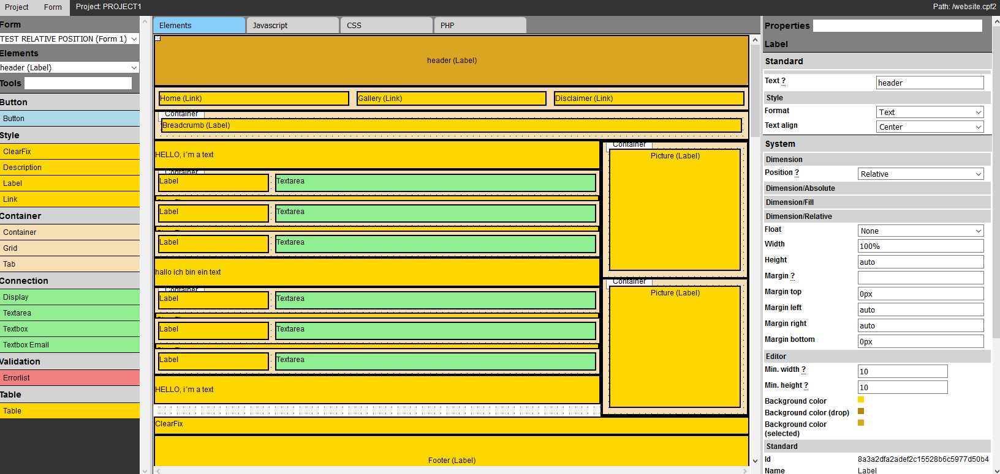

# Formedit
Online IDE for business applications

Setup:
---
Rename the config.inc.php.dist in config.inc.php
Add all required information

Editor
---
Editor mode call:
Url + editor.php

Interpreter
---
working in progress

